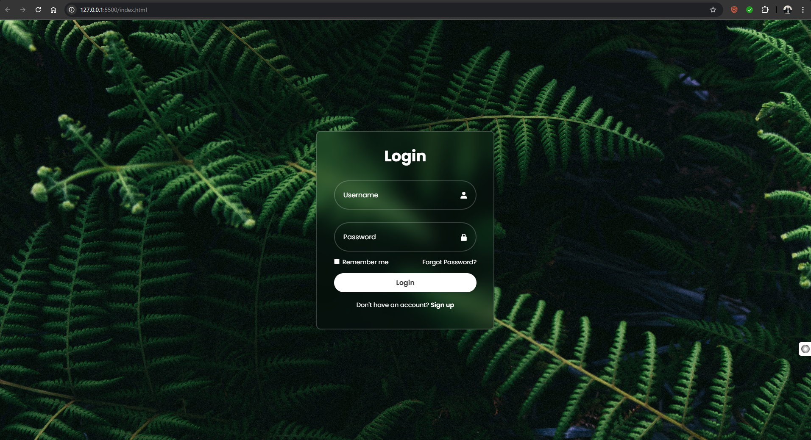

# 🔐 Login Form

A stylish, modern **Login Form** built using **HTML** and **CSS**, with a glassmorphism effect, responsive design, and a clean user interface. Ideal for web applications or demo authentication pages.

 <!-- Replace with an actual screenshot if needed -->

---

## ✨ Features

- 🌫️ Glassmorphism design (frosted background blur)
- 🎨 Transparent form with soft shadows and border highlights
- 🔒 Username and password input fields with icon placeholders
- 🧠 “Remember me” checkbox and “Forgot password” link
- 📱 Fully responsive and centered layout
- ⚙️ Built without JavaScript or frameworks

---

## 📁 Project Structure

login-form/
├── index.html # Main HTML structure
├── style.css # CSS styles (glassmorphism)
└── img.jpg # Background image
